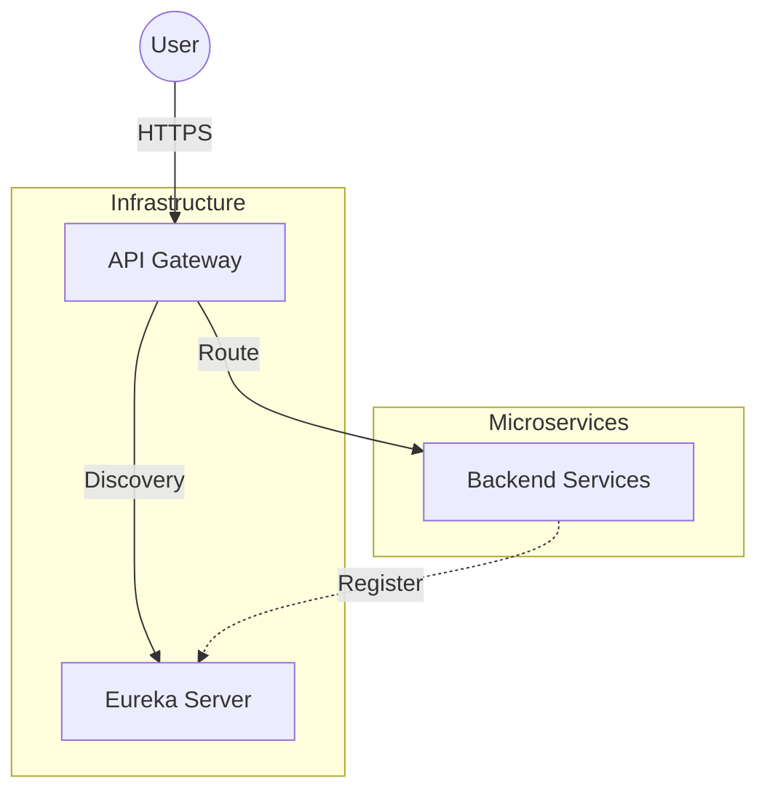

# Alzheimer Risk Detection System


## Overview

The Alzheimer Risk Detection System is a distributed microservices platform for monitoring and supporting Alzheimer’s patients. It uses a **Spring Boot** backend and an **Angular** frontend.

---

## System Architecture



### Core components

- **API Gateway**: Entry point for routing and CORS (`localhost:8090`).
- **Discovery Server (Eureka)**: Service registry (`localhost:8761`).
- **Assistance Quotidienne**: Main REST API (`localhost:8098`).
- **Frontend**: Angular (`localhost:4200`).

---

## Technology stack

### Backend

- Spring Boot 2.7.18, Java 17  
- Spring Cloud Gateway, Eureka  
- Maven  

### Frontend

- Angular  
- PrimeNG, PrimeIcons  

### Local infrastructure

- **MySQL** on `localhost:3306` (e.g. XAMPP), database `assistancequotidiennedb`  

---

## Project structure

```text
alzheimer-system/
├── backend/
│   ├── api-gateway/
│   ├── discovery-server/
│   └── assistance quotidienne/
└── frontend/
    └── alzheimer-angular/
```

---

## Getting started (sans Docker)

### Prerequisites

- Java JDK 17  
- Maven  
- Node.js (v18+)  
- MySQL (ex. XAMPP) — créez la base `assistancequotidiennedb`, utilisateur `root`, mot de passe vide ou adaptez `application.properties`.  

### 1. Démarrer les backends (4 terminaux)

Ordre recommandé :

**Terminal 1 — Eureka**

```bash
cd backend/discovery-server
mvn spring-boot:run
```

Dashboard : http://localhost:8761  

**Terminal 2 — Assistance quotidienne**

```bash
cd "backend/assistance quotidienne"
mvn spring-boot:run
```

API directe : http://localhost:8098/api  

**Terminal 3 — API Gateway**

```bash
cd backend/api-gateway
mvn spring-boot:run
```

Passerelle : http://localhost:8090/api  

Le gateway route tout `/api/**` vers `http://localhost:8098`.

### 2. Frontend

```bash
cd frontend/alzheimer-angular
npm install
npm start
```

Ouvrir http://localhost:4200  

`environment.ts` utilise `http://localhost:8090/api`.

Les WebSockets médecin pointent déjà vers `http://localhost:8098/ws`.

---

## Tests unitaires (TU)

**Backend** (`backend/assistance quotidienne`) — JUnit 5 + Mockito pour les contrôleurs / services ; `@SpringBootTest` pour le chargement du contexte.

```bash
cd "backend/assistance quotidienne"
mvn test
```

**Frontend** (`frontend/alzheimer-angular`) — Jasmine + Karma ; CI sans navigateur visible :

```bash
cd frontend/alzheimer-angular
npm run test:ci
```

Sur Linux (Jenkins / VM), installez **Chromium ou Google Chrome** pour que `ChromeHeadless` puisse démarrer.

**Jenkins** (dépôt multi-niveaux sur GitHub) : dans le job Pipeline « from SCM », **script path** = **`alzheimer-system-main/Jenkinsfile`**. Détails dans [`docs/CI_CD_JENKINS.md`](docs/CI_CD_JENKINS.md).

---

## Security note

The default configuration does **not** enforce JWT or centralized login. For production, add appropriate authentication and tighten Spring Security on the gateway and services.
